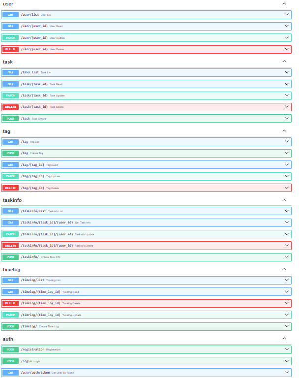
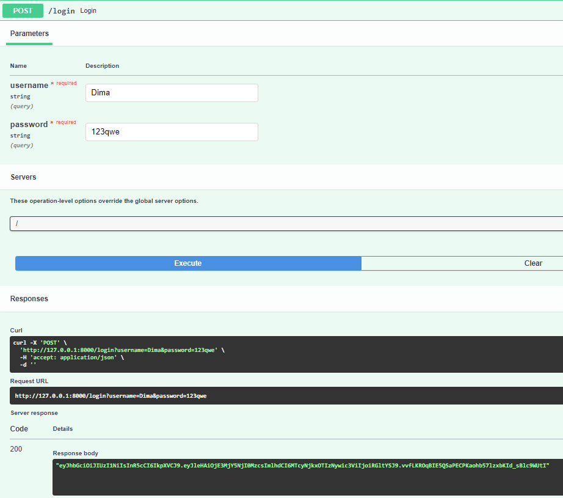
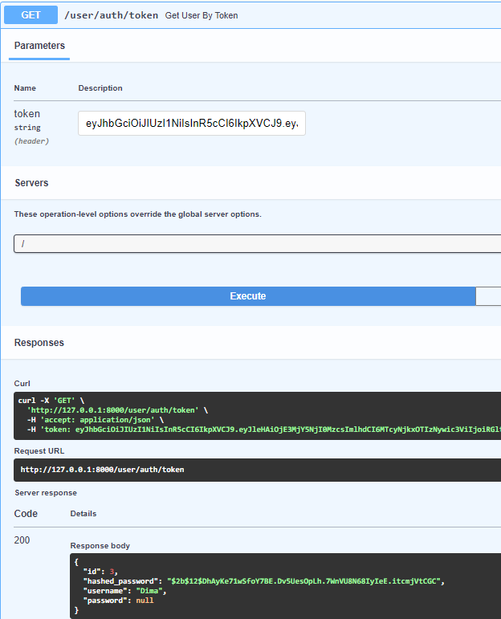

#Лабораторная работа - 1
##Задание
Научится реализовывать полноценное серверное приложение с помощью фреймворка FastAPI с применением дополнительных средств и библиотек.

Разработайте простую программу-тайм-менеджер, которая поможет управлять вашим временем и задачами. Программа должна позволять создавать задачи с описанием, устанавливать им сроки выполнения и приоритеты, а также отслеживать затраченное время на каждую задачу.

Дополнительные функции могут включать в себя уведомления о приближении к дедлайнам, возможность создания ежедневного расписания работы и анализ времени, затраченного на различные задачи.  

###models.py
```py
from typing import List, Optional
from sqlmodel import SQLModel, Field, Relationship
from datetime import datetime

class User(SQLModel, table=True):
    id: int = Field(default=None, primary_key=True)
    username: str
    password: Optional[str] = None
    hashed_password: str
    task_infos: List["TaskInfo"] = Relationship(back_populates="user")

class Task(SQLModel, table=True):
    id: Optional[int] = Field(default=None, primary_key=True)
    title: str
    description: str
    task_infos: List["TaskInfo"] = Relationship(back_populates="task")
    tags: List["TaskTagLink"] = Relationship(back_populates="task")
    time_logs: List["TimeLog"] = Relationship(back_populates="task")

class TaskInfo(SQLModel, table=True):
    task_id: int = Field(foreign_key="task.id", primary_key=True)
    user_id: int = Field(foreign_key="user.id", primary_key=True)
    priority: Optional[int] = None
    deadline: Optional[datetime] = None
    task: Task = Relationship(back_populates="task_infos")
    user: User = Relationship(back_populates="task_infos")

class Tag(SQLModel, table=True):
    id: Optional[int] = Field(default=None, primary_key=True)
    name: str
    description: Optional[str] = None
    tasks: List["TaskTagLink"] = Relationship(back_populates="tag")

class TaskTagLink(SQLModel, table=True):
    task_id: int = Field(foreign_key="task.id", primary_key=True)
    tag_id: int = Field(foreign_key="tag.id", primary_key=True)
    task: Task = Relationship(back_populates="tags")
    tag: Tag = Relationship(back_populates="tasks")

class TimeLog(SQLModel, table=True):
    id: Optional[int] = Field(default=None, primary_key=True)
    task_id: int = Field(foreign_key="task.id")
    start_time: datetime
    end_time: datetime
    task: Task = Relationship(back_populates="time_logs")
```
Для начала я создал БД для своей программы в нёё вошли сущности: User, Task, TaskInfo - ассоциативная сущность, Tag, TaskTagLink, TimeLog. 

###Регистрация с JWT-токеном

```py
import jwt
import bcrypt
from fastapi import APIRouter, Depends, HTTPException, Header
from typing_extensions import Optional
import os
from dotenv import load_dotenv, find_dotenv
from sqlmodel import select
from datetime import datetime, timedelta

from connection import get_session
from models import User


load_dotenv(find_dotenv('..'))
secret_key = os.getenv('SECRET_KEY')


def hash_password(password: str) -> str:
    return bcrypt.hashpw(password.encode(), bcrypt.gensalt()).decode()

def verify_password(password: str, hashed_password: str) -> bool:
    return bcrypt.checkpw(password.encode(), hashed_password.encode())


def encode_token(username: str) -> str:
    payload = {
        'exp': datetime.utcnow() + timedelta(hours=12),
        'iat': datetime.utcnow(),
        'sub': username
    }
    return jwt.encode(payload, secret_key, algorithm='HS256')

def decode_token(token: str) -> str:
    try:
        payload = jwt.decode(token, secret_key, algorithms=['HS256'])
        return payload['sub']
    except jwt.ExpiredSignatureError:
        raise HTTPException(status_code=401, detail='Token expired')
    except jwt.InvalidTokenError:
        raise HTTPException(status_code=401, detail='Invalid token')


router = APIRouter()


@router.post("/registration", tags=["auth"])
def registration(user: User, session=Depends(get_session)) -> dict:
    if user.password is None:
        raise HTTPException(status_code=400, detail='Password must be provided')


    user.hashed_password = hash_password(user.password)
    user.password = None

    session.add(user)
    session.commit()
    session.refresh(user)

    return {"status": 200, "data": user}


@router.post("/login", tags=["auth"])
def login(username: str, password: str, session=Depends(get_session)) -> str:
    query = select(User).where(User.username == username)
    db_user = session.exec(query).one_or_none()
    if not db_user:
        raise HTTPException(status_code=401, detail='Invalid username')

    if not verify_password(password, db_user.hashed_password):
        raise HTTPException(status_code=401, detail='Invalid password')

    token = encode_token(db_user.username)
    return token


@router.get("/user/auth/token", response_model=User, tags=["auth"])
def get_user_by_token(token: Optional[str] = Header(None), session=Depends(get_session)) -> User:
    if not token:
        raise HTTPException(status_code=401, detail='Unauthorized')

    token = token
    user_name = decode_token(token)
    query = select(User).where(User.username == user_name)
    user = session.exec(query).one_or_none()
    if not user:
        raise HTTPException(status_code=404, detail="User not found")
    return user
```
Для задания нужно было реализовать авторизацию и регистрацию, генерацию JWT-токенов, Аутентификацию по JWT-токену, Хэширование паролей.




CRUD-ы



Login



Аутентификация по токену

Вывод к выполненному заданию

Достижения в проделанной работе:

1. Реализация моделей и базы данных
2. Создание API с CRUD-операциями
3. Настройка миграций с Alembic
4. Генерация JWT-токенов и аутентификация по ним
   
Заключение

Выполнение данного задания позволило не только закрепить теоретические знания, 
но и приобрести практические навыки в разработке серверных приложений. 
Реализованный функционал демонстрирует способность создавать безопасные и масштабируемые веб-приложения, 
что является важным шагом в нашем профессиональном развитии. Уверен, что полученные навыки будут полезны в будущих проектах и задачах.
